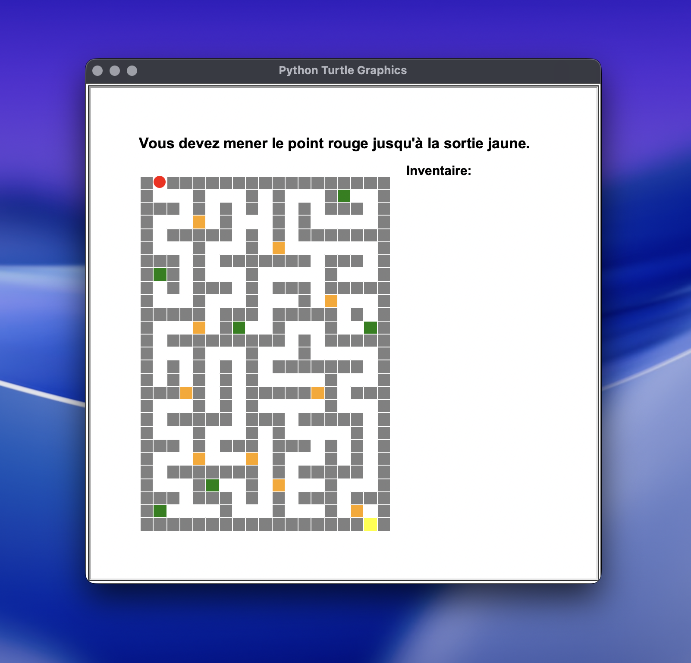
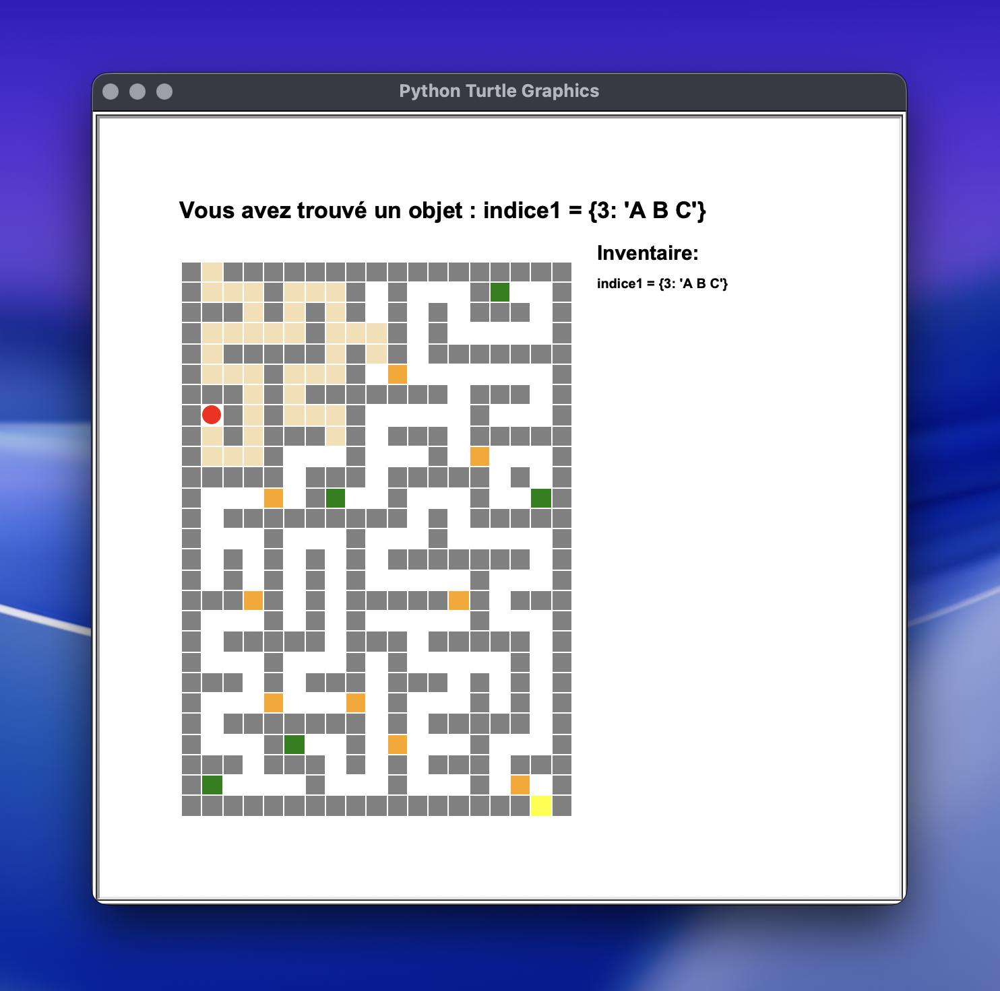
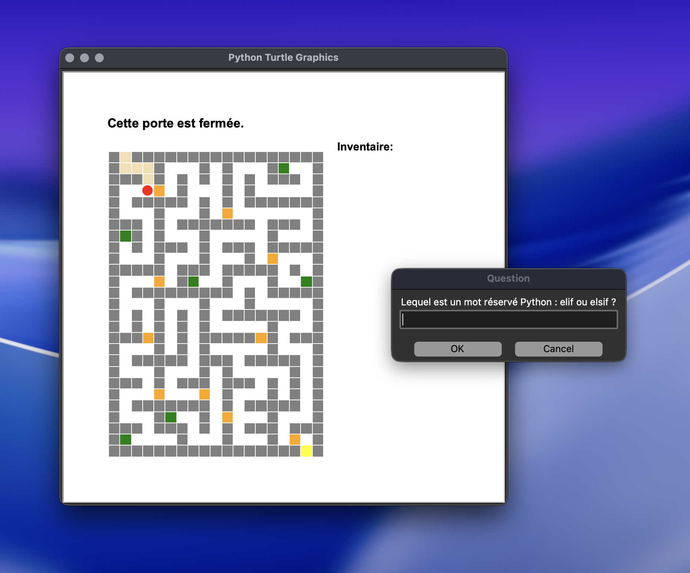

# Escape Game


---

## 📖 Description

Escape Game est un petit jeu d’évasion réalisé en Python avec le module graphique `turtle`. Le joueur déplace un personnage dans un château représenté sous forme de plan, explore les pièces et les couloirs, récupère des objets et répond à des questions pour ouvrir les portes fermées.

L’objectif est simple: atteindre la case de sortie du château en traversant le labyrinthe et en résolvant les énigmes qui bloquent le passage.

---

## 📸 Captures d’écran

| Démarrage | Indice | Question |
| --- | --- | --- |
|  |  |  |

---

## Sommaire

- [Fonctionnalités principales](#-fonctionnalités-principales)
- [Prérequis](#-prérequis)
- [Installation](#-installation)
- [Lancement et exemples d'utilisation](#-lancement-et-exemples-dutilisation)
- [Structure du projet](#-structure-du-projet)
- [Auteurs](#-auteurs)
- [Licence](#-licence)

---

## ⚡ Fonctionnalités principales

- Affichage du château à partir d’une matrice stockée dans un fichier texte.
- Déplacement du personnage avec les flèches du clavier.
- Gestion des murs, des couloirs, des portes, des objets et de la sortie.
- Ouverture des portes en répondant à des questions associées aux cases.
- Ramassage d’objets qui s’ajoutent à l’inventaire affiché à l’écran.
- Affichage de messages d’état pendant la partie.
- Génération d’un export du plan du château en fin d’affichage.

---

## 🛠️ Prérequis

- Python 3.x.
- Le module standard `turtle`, inclus avec Python.
- Les fichiers de données du projet:
   - `data/plan_chateau.txt`
   - `data/dico_portes.txt`
   - `data/dico_objets.txt`

---

## ⚙️ Installation

```bash
git clone <url-du-repo>
cd EscapeGame
```

Aucune dépendance externe n’est nécessaire si Python est déjà installé.

---

## 🎮 Lancement et exemples d'utilisation

```bash
python3 chateau.py
```

### Contrôles

- Déplacement: flèches directionnelles
- Objectif: rejoindre la sortie jaune

### Déroulement

- Le joueur commence sur la case de départ définie dans `CONFIGS.py`.
- Les cases orange correspondent aux portes à débloquer.
- Les cases vertes correspondent aux objets à ramasser.
- Les cases jaunes correspondent à la sortie.

---

## 📂 Structure du projet

```text
EscapeGame/
├── CONFIGS.py                # Paramètres visuels et chemins des données
├── chateau.py                # Logique principale du jeu
├── data/
│   ├── dico_objets.txt       # Correspondance positions -> objets
│   ├── dico_portes.txt       # Correspondance positions -> questions/réponses
│   ├── plan_chateau.txt      # Matrice du château
│   ├── docs/
│   │   ├── chateau.eps       # Export du plan
│   │   └── chateau.pdf       # Export du plan
│   └── screenshots/
│       ├── indice.png
│       ├── question.png
│       └── start.png
├── LICENSE
└── README.md
```

---

## 👤 Auteurs

- Jawad Cherkaoui

---

## 📜 Licence

Ce projet est distribué sous licence MIT.
