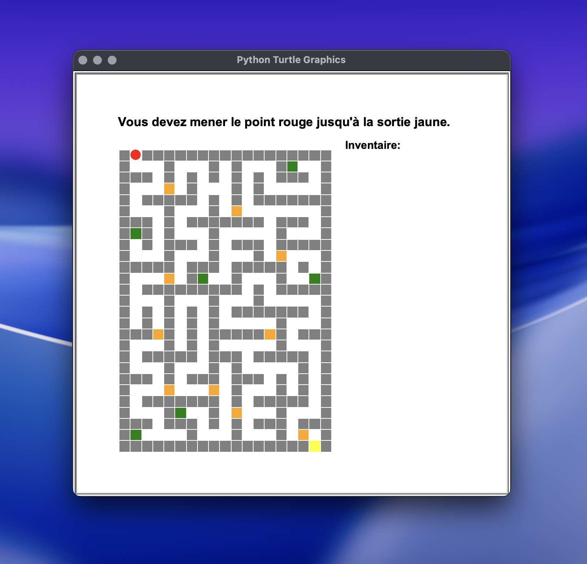
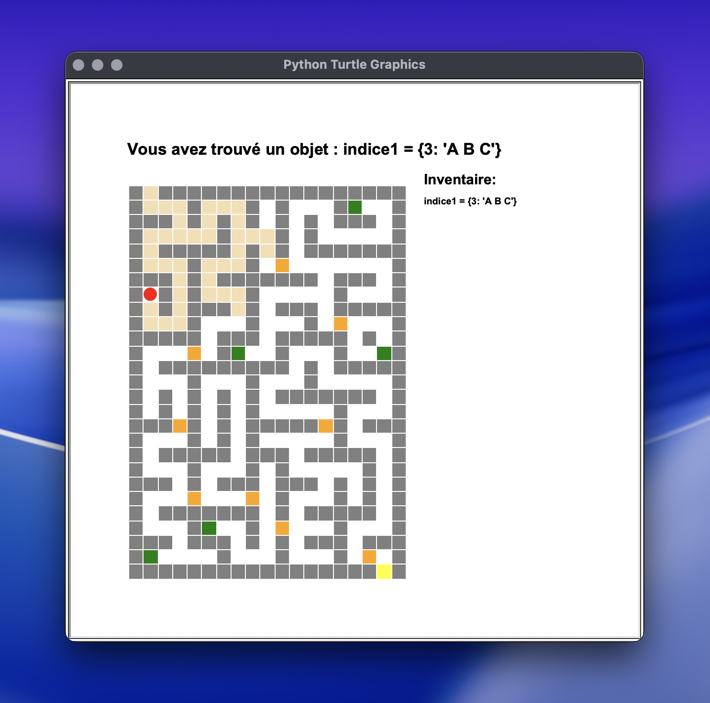
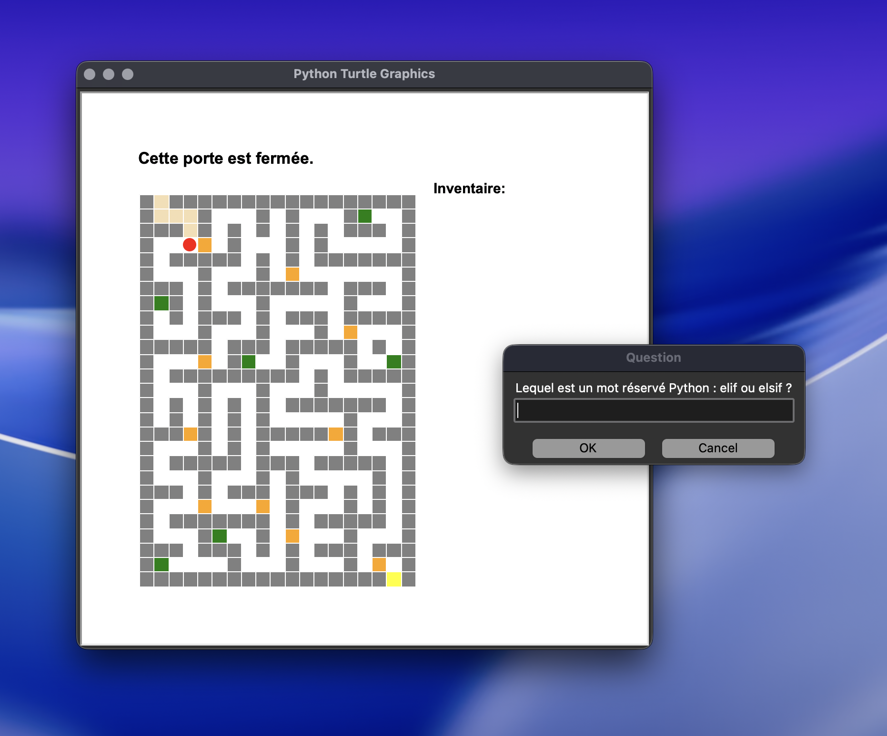

# Escape Game


Escape Game est un **jeu d’évasion en Python avec Turtle**. Explorez les pièces et les couloirs d’un château, ramassez des objets et répondez aux énigmes pour ouvrir les portes qui bloquent le passage.

Le personnage se déplace avec les flèches du clavier. L’objectif est d’atteindre la sortie du château, représenté par un plan chargé depuis les fichiers de données du projet.

> Projet académique ULB — INFO-F101.
> Programmation · 2022–2023

<a id="captures-decran"></a>

## 📸 Captures d’écran

| Démarrage | Indice | Question |
| --- | --- | --- |
|  |  |  |

---

## 📖 Sommaire

- [Fonctionnalités](#fonctionnalites)
- [Prérequis](#prerequis)
- [Installation](#installation)
- [Lancement et utilisation](#lancement-et-utilisation)
- [Structure du projet](#structure-du-projet)

<a id="fonctionnalites"></a>

## ✨ Fonctionnalités

- Affichage du château à partir d’une matrice stockée dans un fichier texte.
- Déplacement du personnage avec les flèches du clavier.
- Gestion des murs, des couloirs, des portes, des objets et de la sortie.
- Ouverture des portes en répondant à des questions associées aux cases.
- Ramassage d’objets qui s’ajoutent à l’inventaire affiché à l’écran.
- Affichage de messages d’état pendant la partie.
- Génération d’un export du plan du château en fin d’affichage.

<a id="prerequis"></a>

## 🧰 Prérequis

- Python 3.x.
- Le module standard `turtle`, inclus avec Python.
- Les fichiers de données du projet:
   - `data/plan_chateau.txt`
   - `data/dico_portes.txt`
   - `data/dico_objets.txt`

<a id="installation"></a>

## 📦 Installation

```bash
git clone https://github.com/9Chrk/EscapeGame.git
cd EscapeGame
```

Aucune dépendance externe n’est nécessaire si Python est déjà installé.

<a id="lancement-et-utilisation"></a>

## ▶️ Lancement et utilisation

```bash
python3 chateau.py
```

### Contrôles

- Déplacement: flèches directionnelles
- Objectif: rejoindre la sortie jaune

### Déroulement

- Le joueur commence sur la case de départ définie dans `CONFIGS.py`.
- Les cases orange correspondent aux portes à débloquer.
- Les cases vertes correspondent aux objets à ramasser.
- Les cases jaunes correspondent à la sortie.

<a id="structure-du-projet"></a>

## 📂 Structure du projet

```text
EscapeGame/
├── CONFIGS.py                # Paramètres visuels et chemins des données
├── chateau.py                # Logique principale du jeu
├── data/
│   ├── dico_objets.txt       # Correspondance positions -> objets
│   ├── dico_portes.txt       # Correspondance positions -> questions/réponses
│   ├── plan_chateau.txt      # Matrice du château
│   ├── docs/
│   │   ├── chateau.eps       # Export du plan
│   │   └── chateau.pdf       # Export du plan
│   └── screenshots/
│       ├── indice.png
│       ├── question.png
│       └── start.png
├── LICENSE
└── README.md
```
